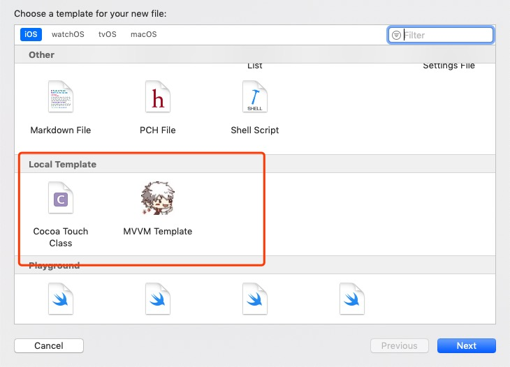

# 自定义xcode模版

## 为什么要自定义Xcode模板

- 代码规范要求
- 初始化时添加固定方法
- 文件中固定的注释

每创建一个类就重写一遍显然很繁琐，这个时候就要用到Xcode的自定义模板功能。

这里创建了两个模版

[基于系统 Cocoa Touch Class 初始模版修改](./Local%20Template/MVVM%20Template.xctemplate)

和

[MVVM 文件夹模块模版](./Local%20Template/Cocoa%20Touch%20Class.xctemplate)

## 使用的方法

将 [Local Template](Local%20Template)放置到[文件模版路径](/Applications/Xcode.app/Contents/Developer/Platforms/iPhoneOS.platform/Developer/Library/Xcode/Templates/File%20Templates)中

在Xcode中创建 new file，即可看到新的模版样式

使用方式同系统模版

## 目标路径

[文件模板路径1](/Applications/Xcode.app/Contents/Developer/Platforms/iPhoneOS.platform/Developer/Library/Xcode/Templates/File%20Templates/Source)

[文件模板路径2](/Applications/Xcode.app/Contents/Developer/Library/Xcode/Templates/File%20Templates/)

[工程模板路径](/Applications/Xcode.app/Contents/Developer/Platforms/iPhoneOS.platform/Developer/Library/Xcode/Templates/Project%20Templates/iOS/Application)

## 常用的宏

|宏|意义|
|---|---|
| `___FILENAME___`|文件名包括后缀|
| `___PROJECTNAME___`|工程名|
| `___FULLUSERNAME___`|用户的名字|
| `___DATE___`|当前日期，年月日|
| `___COPYRIGHT___`|版权|
| `___FILEBASENAME___`|不带后缀的文件名|
| `___FILEBASENAMEASIDENTIFIER___`|不带后缀的 VC 文件名|
| `___VARIABLE_productName___`|不带后缀的 VC 文件名|

## 需要修改的字段

|宏|意义|
|---|---|
| `SortOrder`|模版在界面中排序的优先级|
| `Options`||
| `FallbackHeader`|用.h 导入的头文件|
| `RequiredOptions -> cocoaSubclass`|是否支持选择 xib；Default 默认 true 自动勾选|
| `Values`|自定义模版的名称(一定要保持一致)|
| `Suffixes`|模版默认类名，效果如下图|
| `Platforms`|适用的设备ID|
